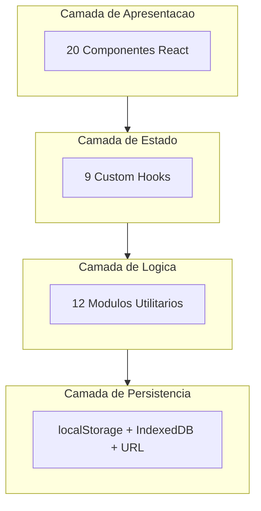

# Arquitetura do forge Diagram

Este documento descreve a arquitetura do forge Diagram, um editor profissional de diagramas Mermaid e PlantUML com suporte a Markdown.

## Indice

1. [Visao Geral](#visao-geral)
2. [Stack Tecnologico](#stack-tecnologico)
3. [Diagramas de Arquitetura](#diagramas-de-arquitetura)
4. [Estrutura de Pastas](#estrutura-de-pastas)
5. [Camadas da Aplicacao](#camadas-da-aplicacao)
6. [Componentes](#componentes)
7. [Hooks](#hooks)
8. [Utilitarios](#utilitarios)
9. [Tipos e Interfaces](#tipos-e-interfaces)
10. [Fluxo de Dados](#fluxo-de-dados)
11. [Persistencia](#persistencia)
12. [Decisoes Arquiteturais](#decisoes-arquiteturais)

---

## Visao Geral

O forge Diagram e uma aplicacao web SPA (Single Page Application) construida com React e TypeScript. A aplicacao segue uma arquitetura em camadas com separacao clara de responsabilidades:

- **Camada de Apresentacao**: Componentes React para UI
- **Camada de Estado**: Hooks customizados para gerenciamento de estado
- **Camada de Logica**: Utilitarios para processamento de dados
- **Camada de Persistencia**: localStorage, IndexedDB e File System API

---

## Stack Tecnologico

| Tecnologia | Uso |
|------------|-----|
| React 18 | Framework UI |
| TypeScript | Tipagem estatica |
| Vite | Build tool e dev server |
| CodeMirror 6 | Editor de codigo |
| Mermaid.js | Renderizacao de diagramas |
| PlantUML | Diagramas via servidor externo |
| Tailwind CSS | Estilizacao |
| pako | Compressao para URLs compartilhaveis |
| react-zoom-pan-pinch | Zoom e pan no preview |

---

## Diagramas de Arquitetura

### HLD - High-Level Design

O diagrama de alto nivel mostra as principais camadas e modulos da aplicacao:




**Arquivo completo**: [diagrams/hld-architecture.mmd](diagrams/hld-architecture.mmd)

### LLD - Low-Level Design (Data Flow)

O diagrama de baixo nivel mostra o fluxo de dados detalhado:

**Arquivo completo**: [diagrams/lld-dataflow.mmd](diagrams/lld-dataflow.mmd)

### Diagrama de Componentes/Pacotes

Organizacao dos modulos do projeto:

**Arquivo completo**: [diagrams/component-packages.mmd](diagrams/component-packages.mmd)

### Diagrama de Classes

Principais interfaces e tipos do sistema:

**Arquivo completo**: [diagrams/class-diagram.mmd](diagrams/class-diagram.mmd)

### Diagramas de Sequencia

Fluxos detalhados de interacao:

- **Fluxo de Edicao**: [diagrams/sequence-edit-flow.mmd](diagrams/sequence-edit-flow.mmd)
- **Fluxo de Exportacao**: [diagrams/sequence-export-flow.mmd](diagrams/sequence-export-flow.mmd)
- **Fluxo de Workspace**: [diagrams/sequence-workspace-flow.mmd](diagrams/sequence-workspace-flow.mmd)

---

## Estrutura de Pastas

```
forge_diagram/
├── components/           # Componentes React
│   ├── ActivityBar.tsx      # Barra lateral de navegacao
│   ├── CodeEditor.tsx       # Editor CodeMirror
│   ├── FileExplorer.tsx     # Explorador de arquivos
│   ├── FileTreeItem.tsx     # Item da arvore de arquivos
│   ├── ImportDialog.tsx     # Dialog de importacao
│   ├── MarkdownPreview.tsx  # Preview de Markdown
│   ├── MarkdownThemeSelector.tsx
│   ├── Minimap.tsx          # Minimap do diagrama
│   ├── MobileTabBar.tsx     # Tab bar mobile
│   ├── ResizeHandle.tsx     # Handle de redimensionamento
│   ├── SaveLoadDialog.tsx   # Dialog salvar/carregar
│   ├── SearchPanel.tsx      # Painel de busca
│   ├── ShareDialog.tsx      # Dialog de compartilhamento
│   ├── Sidebar.tsx          # Container do sidebar
│   ├── TabBar.tsx           # Barra de abas
│   ├── TemplateSelector.tsx # Seletor de templates
│   ├── ThemeSelector.tsx    # Seletor de temas
│   ├── Toolbar.tsx          # Toolbar principal
│   └── EmbedDialog.tsx      # Dialog de embed
│
├── hooks/                # Custom Hooks
│   ├── useActivityBar.ts    # Estado do sidebar
│   ├── useDiagramStorage.ts # Persistencia de diagramas
│   ├── useExport.ts         # Exportacao
│   ├── useHistory.ts        # Undo/Redo de codigo
│   ├── useKeyboardShortcuts.ts
│   ├── useMediaQuery.ts     # Responsividade
│   ├── useTabs.ts           # Gerenciamento de abas
│   ├── useVisualHistory.ts  # Undo/Redo visual
│   └── useWorkspace.ts      # File System API
│
├── utils/                # Utilitarios
│   ├── diagramTemplates.ts  # Templates de diagramas
│   ├── embedUtils.ts        # Geracao de embeds
│   ├── exportUtils.ts       # Exportacao PNG/SVG
│   ├── fileSystemUtils.ts   # File System Access API
│   ├── importUtils.ts       # Importacao PlantUML/draw.io
│   ├── markdownThemes.ts    # Temas de Markdown
│   ├── mermaidLinter.ts     # Validacao de sintaxe
│   ├── mermaidThemes.ts     # Temas Mermaid
│   ├── mermaidUtils.ts      # Utilitarios Mermaid
│   ├── plantumlUtils.ts     # Integracao PlantUML
│   ├── shareUtils.ts        # Compartilhamento via URL
│   └── storageUtils.ts      # localStorage helpers
│
├── docs/                 # Documentacao
│   ├── ARCHITECTURE.md      # Este arquivo
│   └── diagrams/            # Diagramas Mermaid
│
├── App.tsx               # Componente raiz
├── main.tsx              # Entry point
├── types.ts              # Tipos TypeScript
└── index.html            # HTML template
```

---

## Camadas da Aplicacao

### 1. Camada de Apresentacao (Components)

Responsavel pela interface do usuario. Dividida em subcategorias:

| Categoria | Componentes | Responsabilidade |
|-----------|-------------|------------------|
| **Layout** | ActivityBar, Sidebar, TabBar, Toolbar | Estrutura visual |
| **Editores** | CodeEditor, MarkdownPreview, Minimap | Edicao e visualizacao |
| **Dialogos** | SaveLoadDialog, ShareDialog, ImportDialog, EmbedDialog | Acoes modais |
| **Seletores** | ThemeSelector, TemplateSelector, MarkdownThemeSelector | Escolha de opcoes |
| **File System** | FileExplorer, FileTreeItem, SearchPanel | Navegacao de arquivos |

### 2. Camada de Estado (Hooks)

Gerenciamento de estado via custom hooks:

| Hook | Responsabilidade | Persistencia |
|------|------------------|--------------|
| `useTabs` | Abas abertas (max 10) | localStorage |
| `useActivityBar` | Estado do sidebar | localStorage |
| `useDiagramStorage` | Diagramas salvos | localStorage |
| `useWorkspace` | File System API | IndexedDB |
| `useHistory` | Undo/Redo de codigo | Memoria |
| `useVisualHistory` | Undo/Redo de posicoes | Memoria |
| `useExport` | Estado de exportacao | - |
| `useKeyboardShortcuts` | Atalhos globais | - |
| `useMediaQuery` | Responsividade | - |

### 3. Camada de Logica (Utils)

Processamento de dados e integracao:

| Modulo | Funcoes Principais |
|--------|-------------------|
| `mermaidUtils` | `detectOrientation()`, `toggleOrientationInCode()` |
| `mermaidThemes` | 10+ temas customizados |
| `mermaidLinter` | `validateMermaidSyntax()`, `detectDiagramType()` |
| `plantumlUtils` | `renderPlantUML()`, `encodePlantUML()` |
| `exportUtils` | `svgToPng()`, `downloadBlob()` |
| `importUtils` | `convertPlantUML()`, `convertDrawIO()` |
| `shareUtils` | `encodeForUrl()`, `generateShareUrl()` |
| `storageUtils` | `saveDiagram()`, `getDiagrams()` |
| `fileSystemUtils` | `openDirectory()`, `readDirectoryRecursive()` |

### 4. Camada de Persistencia

| Mecanismo | Dados | Chave |
|-----------|-------|-------|
| localStorage | Abas | `forge-draw-tabs` |
| localStorage | Diagramas salvos | `mermaid-pro-viz-diagrams` |
| localStorage | Configuracoes | `mermaid-pro-viz-settings` |
| localStorage | Auto-save | `mermaid-pro-viz-autosave` |
| localStorage | Sidebar | `forge-diagram-activitybar` |
| IndexedDB | Workspace handle | `forge-draw-workspace-handle` |
| URL Hash | Diagrama compartilhado | `#code=<encoded>` |

---

## Componentes

### Componentes de Layout

#### ActivityBar
Barra vertical a esquerda com icones para navegacao:
- Explorer (arvore de arquivos)
- Search (busca em arquivos)
- Diagrams (diagramas salvos)
- Settings (configuracoes)

#### Sidebar
Container redimensionavel (150-500px) que exibe o conteudo da view ativa.

#### TabBar
Gerencia multiplas abas (max 10) com:
- Indicador de tipo (diagrama/markdown)
- Estado "dirty" (modificado)
- Rename in-place
- Dropdown para nova aba

#### Toolbar
Barra principal com controles contextuais:
- **Modo Diagrama**: Temas, Templates, Orientacao
- **Modo Markdown**: Temas de leitura
- **Comum**: Dark mode, Zoom, Export, Share

### Componentes de Edicao

#### CodeEditor
Editor avancado baseado em CodeMirror 6:
- Syntax highlighting
- Linting em tempo real
- Bracket matching
- Code folding
- Atalhos customizados

#### MarkdownPreview
Parser completo de Markdown com:
- Headers, listas, blockquotes
- Code blocks com syntax highlighting
- Diagramas Mermaid/PlantUML embutidos
- Suporte a temas visuais

### Componentes de File System

#### FileExplorer
Gerencia workspace com:
- File System Access API (Chrome/Edge)
- Fallback para upload de pasta
- Reabrir ultimo workspace

#### FileTreeItem
Renderizacao recursiva da arvore:
- Expansao automatica (2 niveis)
- Icones por tipo de arquivo
- Selecao com highlight

---

## Hooks

### useTabs

```typescript
interface UseTabsReturn {
  tabs: DiagramTab[];
  activeTab: DiagramTab | null;
  addTab: (type?: TabType) => void;
  closeTab: (id: string) => void;
  selectTab: (id: string) => void;
  renameTab: (id: string, name: string) => void;
  updateTabCode: (id: string, code: string) => void;
}
```

### useWorkspace

```typescript
interface UseWorkspaceReturn {
  workspace: Workspace | null;
  isLoading: boolean;
  openFolder: () => Promise<void>;
  openFolderFallback: (files: FileList) => void;
  closeWorkspace: () => void;
  readFile: (path: string) => Promise<string>;
  writeFile: (path: string, content: string) => Promise<void>;
  searchFiles: (query: string) => Promise<SearchResult[]>;
}
```

### useHistory

```typescript
interface UseHistoryReturn<T> {
  value: T;
  setValue: (value: T) => void;
  undo: () => void;
  redo: () => void;
  clear: () => void;
  canUndo: boolean;
  canRedo: boolean;
}
```

---

## Utilitarios

### mermaidUtils

```typescript
// Detecta orientacao do diagrama
detectOrientation(code: string): Orientation

// Alterna entre TD e LR
toggleOrientationInCode(code: string): string
```

### exportUtils

```typescript
// Converte SVG para PNG via Canvas
svgToPng(svgElement: SVGElement, scale?: number): Promise<Blob>

// Dispara download de arquivo
downloadBlob(blob: Blob, filename: string): void

// Copia SVG para clipboard
copySvgToClipboard(svg: string): Promise<void>
```

### shareUtils

```typescript
// Comprime codigo para URL (gzip + base64)
encodeForUrl(code: string): string

// Descomprime codigo da URL
decodeFromUrl(encoded: string): string

// Gera URL compartilhavel
generateShareUrl(code: string): string
```

### fileSystemUtils

```typescript
// Abre seletor de pasta (File System Access API)
openDirectory(): Promise<FileSystemDirectoryHandle | null>

// Le pasta recursivamente
readDirectoryRecursive(
  handle: FileSystemDirectoryHandle,
  maxDepth?: number
): Promise<FileNode[]>

// Busca em arquivos do workspace
searchInFiles(
  files: FileNode[],
  query: string,
  readFile: (path: string) => Promise<string>
): Promise<SearchResult[]>
```

---

## Tipos e Interfaces

### Tipos Principais

```typescript
// Tipo de aba
type TabType = 'diagram' | 'markdown';

// Orientacao do diagrama
type Orientation = 'TD' | 'LR';

// Views do sidebar
type ActivityView = 'explorer' | 'search' | 'diagrams' | 'settings';

// Modo da toolbar
type ToolbarMode = 'diagram' | 'markdown';
```

### Interfaces de Dados

```typescript
// Aba do editor
interface DiagramTab {
  id: string;
  name: string;
  code: string;
  isDirty: boolean;
  type: TabType;
  filePath?: string;
}

// Diagrama salvo
interface SavedDiagram {
  id: string;
  name: string;
  code: string;
  createdAt: Date;
  updatedAt: Date;
}

// Workspace
interface Workspace {
  name: string;
  rootPath: string;
  files: FileNode[];
  handle?: FileSystemDirectoryHandle;
  isVirtual: boolean;
}

// No da arvore de arquivos
interface FileNode {
  name: string;
  path: string;
  type: 'file' | 'folder';
  children?: FileNode[];
  handle?: FileSystemFileHandle;
  content?: string;
}
```

---

## Fluxo de Dados

### Fluxo de Edicao

```
Usuario digita
    ↓
CodeEditor.onChange()
    ↓
updateTabCode()
    ↓
useHistory.setValue()  →  Historico de undo/redo
    ↓
Auto-save (5s)  →  localStorage
    ↓
Preview renderiza  →  Mermaid.js / PlantUML Server
    ↓
Minimap atualiza
```

### Fluxo de Exportacao

```
Usuario clica Export
    ↓
ShareDialog abre
    ↓
Seleciona formato (PNG/SVG/URL/MD)
    ↓
useExport processa
    ↓
PNG: svgToPng() → Canvas → Blob → Download
SVG: getSvgString() → Blob → Download
URL: encodeForUrl() → Clipboard
MD: generateMarkdown() → Blob → Download
```

### Fluxo de Workspace

```
Usuario clica Open Folder
    ↓
File System Access API disponivel?
    ├─ Sim: showDirectoryPicker()
    └─ Nao: input[webkitdirectory]
    ↓
readDirectoryRecursive()
    ↓
FileNode[] gerado
    ↓
Handle salvo no IndexedDB (para reabrir)
    ↓
FileExplorer renderiza arvore
    ↓
Clique em arquivo
    ↓
readFileContent()
    ↓
Nova aba criada ou existente atualizada
```

---

## Persistencia

### localStorage

| Chave | Conteudo | Formato |
|-------|----------|---------|
| `forge-draw-tabs` | Array de abas | JSON |
| `forge-diagram-activitybar` | Estado do sidebar | JSON |
| `mermaid-pro-viz-diagrams` | Diagramas salvos | JSON |
| `mermaid-pro-viz-settings` | Configuracoes | JSON |
| `mermaid-pro-viz-autosave` | Backup automatico | JSON |

### IndexedDB

| Database | Store | Uso |
|----------|-------|-----|
| `forge-draw-db` | `workspace-handles` | FileSystemDirectoryHandle |

### URL Hash

Formato: `#code=<base64-gzip>`

```typescript
// Encoding
const compressed = pako.gzip(code);
const base64 = btoa(String.fromCharCode(...compressed));
const urlSafe = base64.replace(/\+/g, '-').replace(/\//g, '_');

// Decoding
const base64 = urlSafe.replace(/-/g, '+').replace(/_/g, '/');
const compressed = Uint8Array.from(atob(base64), c => c.charCodeAt(0));
const code = pako.ungzip(compressed, { to: 'string' });
```

---

## Decisoes Arquiteturais

### 1. CodeMirror 6 vs Monaco

**Escolha**: CodeMirror 6
**Motivo**: Bundle menor, melhor performance mobile, extensibilidade

### 2. File System Access API com Fallback

**Escolha**: API nativa + fallback para upload
**Motivo**: Melhor UX em Chrome/Edge, compatibilidade com outros browsers

### 3. Hooks vs Context/Redux

**Escolha**: Custom hooks com localStorage
**Motivo**: Simplicidade, sem overhead de state management externo

### 4. Mermaid + PlantUML

**Escolha**: Suporte dual
**Motivo**: Mermaid para renderizacao local, PlantUML via servidor para formatos adicionais

### 5. URL Sharing com Compressao

**Escolha**: gzip + base64 URL-safe
**Motivo**: URLs compartilhaveis sem backend, tamanho reduzido

### 6. Max 10 Abas

**Escolha**: Limite de 10 abas
**Motivo**: Performance, UX, limite de localStorage

### 7. Auto-save com Debounce

**Escolha**: 5 segundos de intervalo
**Motivo**: Balanco entre seguranca e performance

### 8. Virtual Workspace

**Escolha**: Workspace em memoria quando File System API indisponivel
**Motivo**: Compatibilidade com Safari/Firefox (read-only)

---

## Conclusao

O forge Diagram utiliza uma arquitetura modular e escalavel, com separacao clara entre apresentacao, estado e logica de negocio. O uso de hooks customizados permite reutilizacao e testabilidade, enquanto a persistencia multi-camada garante que o trabalho do usuario nunca seja perdido.

Para contribuir com o projeto, recomenda-se seguir os padroes estabelecidos:
- Novos componentes em `/components`
- Novos hooks em `/hooks`
- Nova logica em `/utils`
- Tipos em `/types.ts`

---

*Documentacao gerada em Dezembro 2025*
