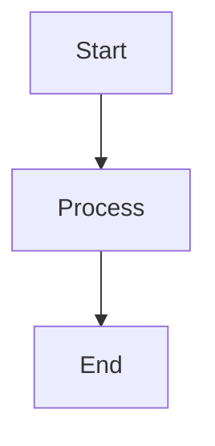

# Test Markdown File

This is a **test** file to verify the *Milkdown* WYSIWYG editor.

## Features to Test

- Bold text
- Italic text
- Lists
- Code blocks

### Code Example

```javascript
function hello() {
  console.log("Hello, World!");
}
```

### Mermaid Diagram



## Table Test

| Name | Age | City |
|------|-----|------|
| John | 30  | NYC  |
| Jane | 25  | LA   |

> This is a blockquote

That's all for testing!
